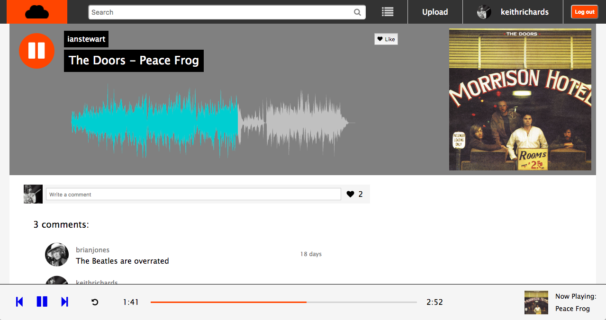

# StoneCloud

[StoneCloud live][stone-cloud]

[stone-cloud]: https://stone-cloud.herokuapp.com/#/

StoneCloud is a full-stack web application inspired by SoundCloud which allows users to upload, play, edit and comment on music files. It uses a PostgreSQL database, has a backend managed by Ruby on Rails and a Redux architectural framework for the frontend.



## Features & Implementation

### Track Rendering, Playback and Editing

Tracks are stored in the database with column entries for title and artist, as well as image files for cover art and the audio files themselves, both of which are uploaded and handled using the Ruby 'paperclip' gem.

On the frontend, tracks can be viewed on both the index page--accessed by typing a query into the search bar--and individual show pages, which display additional information such as comments on the track, likes, etc. Show pages also have waveforms plotting the audio frequency of the associated track, which show the progress of the song when it is played.

Play buttons, which appear on the index page, show pages, and in the playbar, toggle between pause and play images and do so consistently no matter where the user navigates or what changes are posted. This is accomplished by giving all play buttons on the index and show pages an id which contains the id number of the associated track and only syncing buttons whose id matches the id of the song in the playbar. Given this setup, a separate util file with only three play functions (start, play and pause) is all that is needed to manage button syncing.

From the "play_functions" util file:

```javascript
export const startSong = (playbar, buttonImage, playButtonImage, prevButton) => {
  playbar.style.display = "flex";
  playButtonImage.className = "fa fa-pause";

  // ...

  if(buttonImage) {
    buttonImage.className = "fa fa-pause";
  }
  if(prevButton) {
    prevButton.className = "fa fa-play";
  }
}
```

From the track show page's "togglePlay" function:

```javascript
const playbar = document.getElementById('playbar');
const buttonImage = document.getElementById('fa-' + this.props.track.id);
const prevButton = document.getElementById('fa-' + this.props.nowPlaying.id);
const playButtonImage = document.getElementById('playbar-button-img');

if(song.src != this.props.track.song_url) {
  startSong(playbar, playButtonImage, buttonImage, prevButton);
} else {
  // ...
}
```

### Playbar

Clicking on a play button on either an index item or a show page causes a playbar to appear at the bottom of the screen, with track info, progress info and play controls. It remains on the screen as long as the song is playing, irrespective of which page the user navigates to.

Like the waveforms, the progress bar has a click handler which allows the user to jump to different positions in the song:

```javascript
const prog = document.getElementById('outer-bar');
const song = document.getElementById('song');

prog.addEventListener("click", (position) => {
  song.currentTime = (position.clientX-prog.offsetLeft)/
                      (prog.offsetWidth/song.duration);
});
```

(Note that the event handler is not on the progress bar itself but on an invisible "outer bar." This contributes to ease of use since the progress bar itself is only 3 pixels wide and somewhat difficult to click on.)

The playbar also has a "loop" button which when selected will cause the song to replay when it finishes rather than go on to the next song in the tracklist.

### Tracklist

The site keeps track of a song queue that the user can manipulate by adding or removing songs, which will play in the order specified. Users can navigate the queue either by clicking on items in the tracklist or using the playbar's forward and back buttons. Tracklist clears when the final song is finished playing.

### Uploading and Editing

All users are able to upload and edit songs. All show pages include a box with buttons for editing and deleting tracks, which is only visible to the user who posted the track (this restriction is enforced both on the frontend and on the backend, which rejects edit and delete requests if the current user's id does not match the "user_id" associated with the track).

Users can also post comments, which are rendered instantly and deletable, again, only by the user who posted them. Users can also "like" tracks. A limit of one like per track per user is enforced.

## The Way of the Future

### History

One important feature yet to be implemented is a record of each user's listening history, which should be both dynamically updated (tracks shown in order of most recently played, no duplicates) and editable.

### User Playlists

Another valuable feature would be for users to be able to create and save playlists to be played later, rather than only having one available tracklist which clears whenever the user logs out or selects a song not on the list.

### Own Waveforms

Currently, the waveforms on the track show pages are being generated by an external JavaScript library called wavesurfer-js. In the future I would like implement waveforms which I have designed myself so I have more control over their design and customization.
